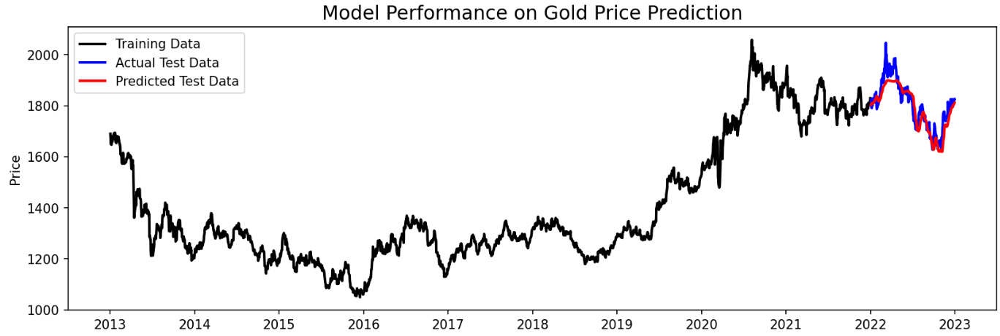

# Gold Price Prediction

## Overview

The Gold Price Prediction project leverages time series analysis and machine learning to forecast gold prices. Using historical data, this project aims to provide accurate predictions for future gold prices, aiding investors and financial analysts in making informed decisions.

## Features

- **Time Series Analysis**: The project employs time series analysis techniques to understand and model the temporal patterns in gold prices.
- **LSTM Neural Networks**: Long Short-Term Memory (LSTM) neural networks are utilized for sequence prediction, enabling the model to capture complex relationships in the time series data.
- **Visualization**: The project includes visualizations of both historical and predicted gold prices, offering insights into the model's performance.

## Dependencies
- **Python 3.9**
- **NumPy**
- **Pandas**
- **Plotly**
- **Sklearn**
- **TensorFlow**
